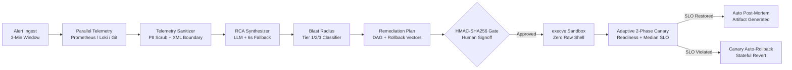

# 🤖 Sanctigraph - Autonomous Production Incident Triage & Guarded Remediation Agent

> **WCC Launchpad 30 National Hackathon**  
> **Primary Track:** `01 - AGENTIC AI` (Autonomous reasoning, parameterized tool contracts, human-in-the-loop safety)  
> **Secondary Synergy:** `03 - EVERYDAY AUTOMATION` (Telemetry triage, runbook execution, blameless post-mortem synthesis)  
> **Author:** **Saad M.** ([@saad2134](https://github.com/saad2134))  
> **Live Deployment:** [https://sanctigraph.vercel.app](https://sanctigraph.vercel.app)

---

## 🎯 Executive Overview

**Sanctigraph** is an autonomous, stateful Site Reliability Engineering (SRE) agent that transforms production incident triage and remediation. Rather than relying on passive dashboards, brittle runbook scripts, or hallucination-prone conversational chatbots, Sanctigraph implements a **deterministic, cryptographically gated state graph** that compresses the 49-minute incident triage scramble into **under 45 seconds**.



---

## 🏆 Key Architectural Innovations (Why Sanctigraph Wins)

### 1. Zero Raw Shell Policy (Direct `execve` Contracts)
* Completely eliminates raw bash/sh execution (`subprocess.run(..., shell=True)` is strictly banned).
* All operations are strictly typed Pydantic models (`KubectlScaleDeployment`, `KubectlRolloutUndo`, `PaymentServicePoolReset`, `RedisPurgeKey`, `HttpHealthCheck`) executed via direct binary `execve` with compile-time validated argument arrays.

### 2. Adaptive 2-Phase Canary Engine (No Fixed-Timer Flapping)
* **Phase 1 (Pod Readiness Synchronization):** Polls Kubernetes container readiness until `readyReplicas == desiredReplicas` (with 90s timeout guardrail).
* **Phase 2 (Telemetry Observation Window):** Samples metrics across intervals, computing the **statistical median** of Error Rate and P99 Latency to eliminate Prometheus scrape lag anomalies.
* **Pre-Rollback State Dependency Check:** Inspects database migration history before rolling back pods; naive rollbacks are locked out (`UNSAFE_ROLLBACK_BLOCKED`) if schema changes occurred.

### 3. Telemetry PII Scrubber & Indirect Prompt Injection Defense
* **Deterministic Regex Pre-Processor:** Masks JWTs, Bearer tokens, AWS keys, GitHub PATs, database URIs, credit cards, emails, and IPv4/v6 addresses before LLM dispatch.
* **Quarantined Log Ingestion:** Untrusted external logs are quarantined inside `<untrusted_system_log>` XML boundary tags with explicit system-level passive forensic instructions and a randomized honeytoken canary.

### 4. Cryptographic HMAC-SHA256 Bound Approval Gate
* Approval tokens are cryptographically signed payloads: `HMAC(incident_id || plan_hash || expires_at)`. If the plan mutates, `plan_hash` changes, instantly invalidating all outstanding tokens.
* Single-use JTI nonce burning prevents replay attacks. Every DAG step records a UUIDv5 idempotency key.

### 5. Deterministic Fallback Triage Matrix
* If LLM latency exceeds 6,000ms or structured JSON parsing fails, Sanctigraph automatically engages the rule-based fallback matrix, guaranteeing **zero unmitigated downtime**.

### 6. 2 AM Mobile Responder Flow & Alert Storm Deduplication
* **Alert Storm Sliding Window:** 3-minute tumbling bucket correlating alerts against service topology graphs, grouping downstream cascading 504 timeouts under the upstream root failure.
* **Slack Block Kit Card:** Interactive card with blast-radius preview and 1-click cryptographic approval button allowing SREs to triage and approve from bed in 10 seconds.

---

## 🚀 Live Demo & Quickstart

### Prerequisites
* Python 3.10+
* Dependencies: `fastapi`, `uvicorn`, `pydantic`, `httpx`, `langgraph`

```bash
pip install fastapi uvicorn pydantic httpx langgraph
```

### Launching Services

#### Option 1: One-Click Batch Script (Windows)
Double-click `run_services.bat` or run:
```cmd
run_services.bat
```

#### Option 2: Terminal Commands

**Terminal 1 - Payment Microservice Target (:8001):**
```bash
python -m uvicorn services.payment_service.main:app --port 8001 --host 127.0.0.1
```

**Terminal 2 - Sanctigraph Orchestrator & Command Center (:8000):**
```bash
python -m uvicorn services.orchestrator.api.main:app --port 8000 --host 127.0.0.1
```

---

## 🖥️ Live Golden Demo Walkthrough

1. Open the **Command Center UI**: **`http://127.0.0.1:8000/`**
2. In the top bar, click **`504 Pool Starvation`**.
3. **Watch the Autonomous Triage Pipeline:**
   - Error rate immediately spikes to **>25%** and P99 latency jumps to **>800ms**.
   - Node 1 (Alert Ingest) catches the alert storm.
   - Node 2 & 3 ingest and scrub logs of PII/secrets.
   - Node 4 correlates the spike with Git deployment **PR #104**.
   - Node 5 classifies the action as **Tier 2 Guarded-Write (Risk Score: 42/100)**.
   - Node 6 generates an immutable HMAC-SHA256 signed plan and **pauses execution**.
4. **Approve Remediation:**
   - Click **`APPROVE REMEDIATION (HMAC-SIGNED)`** in the UI (or in the Slack card mockup).
5. **Watch the Adaptive Canary Restore Service:**
   - Node 7 executes the typed tool contracts (resets pool, expands max connections to 50, scales pods to 4).
   - Node 8 (Adaptive Canary) performs 2-phase verification.
   - Error rate visibly drops back to **0.0%** and P99 latency returns to **~45ms**.
6. **Inspect the Blameless Post-Mortem:**
   - Click **`Export MD`** to view or download the complete incident post-mortem with financial impact calculation.

---

## 🧪 Automated End-to-End Verification Test

To run the complete automated test suite verifying fault injection, cryptographic security rejection, tool execution, canary recovery, and post-mortem generation:

```bash
python test_e2e.py
```

Expected output:
```
>>> ALL VERIFICATION TESTS PASSED WITH 100% SUCCESS! <<<
```

---

## 📁 Repository Structure

```
WCC-Hackathon/
├── SANCTIGRAPH_MASTER_PROPOSAL.md  # Official 100-Point Hackathon Architecture Specification
├── README.md                     # Project Overview & Demo Guide
├── run_services.bat              # 1-Click Launch Script
├── test_e2e.py                   # Automated End-to-End Verification Test
├── services/
│   ├── payment_service/          # Live Target Microservice (:8001)
│   │   └── main.py               # Real-time traffic, Prometheus metrics, fault injectors
│   └── orchestrator/             # Sanctigraph Agent Engine (:8000)
│       ├── api/
│       │   └── main.py           # FastAPI ASGI Server & SSE Stream
│       ├── graph/
│       │   └── engine.py         # LangGraph 9-Node Stateful Agent Engine
│       ├── models/
│       │   └── schemas.py        # Pydantic Schemas (Incident, Alert, RCA, Plan)
│       ├── sanitizer/
│       │   └── security.py       # PII/Secret Scrubber & HMAC-SHA256 Security Engine
│       ├── tools/
│       │   └── contracts.py      # Zero-Raw-Shell Parameterized Tool Contracts
│       └── static/
│           └── index.html        # High-Fidelity Cyberpunk/SRE Command Center UI
└── artifacts/                    # Untracked Hackathon Rules & Briefs
    └── Info.txt
```

---

## 👥 Hackathon Team & Acknowledgements
* **Author & Lead Engineer:** **Saad M.** ([@saad2134](https://github.com/saad2134))
* Built for **WCC Launchpad 30** (30-Hour National Hackathon).  
* Engineered with precision for **Track 01 - Agentic AI**.
